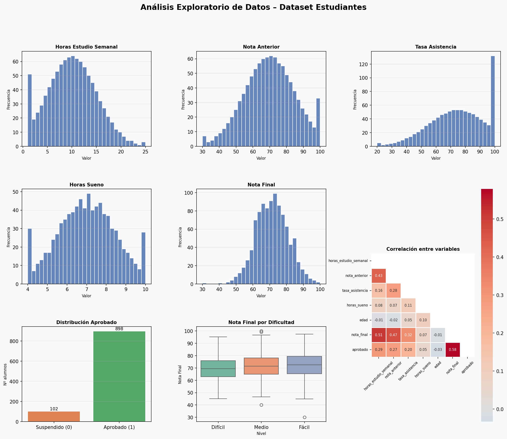
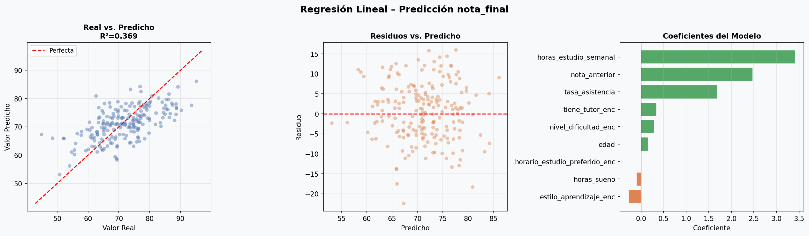
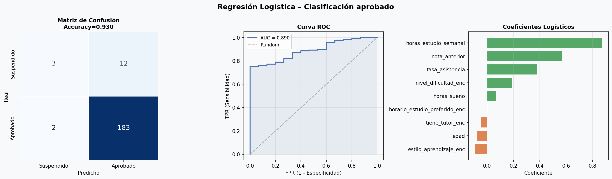

# 🎓 Proyecto Machine Learning — Rendimiento Académico de Estudiantes

Proyecto de Machine Learning desarrollado como parte del módulo **Regresión & Clasificación**. A partir de un dataset de 1.000 estudiantes, se construyen dos modelos predictivos: uno de **regresión lineal** para predecir la nota final, y uno de **regresión logística** para clasificar si el alumno aprueba o no.

---

## 📁 Estructura del proyecto

```
proyecto_ml/
├── proyecto_ml.ipynb          # Notebook principal
├── proyecto_ml.py             # Script Python equivalente
├── dataset_estudiantes.csv    # Dataset original
├── fig1_eda.png               # Gráficas del análisis exploratorio
├── fig2_regresion.png         # Resultados del modelo de regresión lineal
├── fig3_clasificacion.png     # Resultados del modelo de regresión logística
└── README.md                  # Este archivo
```

---

## 📊 Dataset

El dataset `dataset_estudiantes.csv` contiene información sobre el rendimiento académico de 1.000 estudiantes.

| Columna | Tipo | Descripción |
|---|---|---|
| `horas_estudio_semanal` | float | Horas de estudio semanales |
| `nota_anterior` | float | Nota obtenida en la convocatoria anterior |
| `tasa_asistencia` | float | Porcentaje de asistencia a clase |
| `horas_sueno` | float | Promedio de horas de sueño diarias |
| `edad` | int | Edad del alumno |
| `nivel_dificultad` | cat | Dificultad percibida (Fácil / Medio / Difícil) |
| `tiene_tutor` | cat | Si el alumno tiene tutor (Sí / No) |
| `horario_estudio_preferido` | cat | Mañana / Tarde / Noche |
| `estilo_aprendizaje` | cat | Visual / Auditivo / Lectura-Escritura / Kinestésico |
| `nota_final` ⭐ | float | **Variable objetivo — regresión** (0–100) |
| `aprobado` ⭐ | int | **Variable objetivo — clasificación** (1 si nota ≥ 60) |

---

## 🔍 1. Análisis Exploratorio (EDA)

- **1.000 registros**, sin filas duplicadas.
- Valores nulos detectados en tres columnas:
  - `horas_sueno`: 150 nulos (15%)
  - `horario_estudio_preferido`: 100 nulos (10%)
  - `estilo_aprendizaje`: 50 nulos (5%)
- La variable `aprobado` está **desbalanceada**: 898 aprobados (90%) vs. 102 suspendidos (10%).
- Las correlaciones más fuertes con `nota_final` son `horas_estudio_semanal`, `nota_anterior` y `tasa_asistencia`.



---

## ⚙️ 2. Preprocesamiento

1. **Imputación de nulos:**
   - Variables categóricas (`estilo_aprendizaje`, `horario_estudio_preferido`) → imputadas con la **moda**.
   - Variables numéricas (`horas_sueno`) → imputadas con la **mediana**.

2. **Codificación de categóricas:** `LabelEncoder` aplicado a `nivel_dificultad`, `tiene_tutor`, `horario_estudio_preferido` y `estilo_aprendizaje`.

3. **Escalado:** `StandardScaler` sobre todas las features para normalizar la escala.

4. **Split train/test:** 80% entrenamiento (800 registros) / 20% test (200 registros), con `random_state=42`.

---

## 📈 3. Regresión Lineal — predicción de `nota_final`

**Objetivo:** predecir la nota final del alumno (variable continua entre 0 y 100).

### Resultados

| Métrica | Valor |
|---|---|
| MAE | 5.87 |
| RMSE | 7.19 |
| R² | 0.37 |

### Interpretación

El modelo explica el 37% de la varianza en la nota final. Las variables con mayor peso positivo en la predicción son `horas_estudio_semanal`, `nota_anterior` y `tasa_asistencia`, lo que tiene coherencia intuitiva: estudiar más, haber rendido bien antes y asistir a clase mejoran la nota. El R² moderado sugiere que factores no recogidos en el dataset (motivación, calidad del estudio, etc.) también influyen.



---

## 🔵 4. Regresión Logística — clasificación de `aprobado`

**Objetivo:** predecir si el alumno aprueba o no (variable binaria: 1 = aprobado, 0 = suspendido).

### Resultados

| Métrica | Valor |
|---|---|
| Accuracy | 93% |
| AUC-ROC | 0.89 |
| Precision (suspendido) | 0.60 |
| Recall (aprobado) | 0.99 |

### Interpretación

El modelo alcanza una accuracy del 93% y un AUC-ROC de 0.89, lo que indica una muy buena capacidad discriminativa. Sin embargo, debido al **desbalanceo de clases**, el recall de la clase minoritaria (suspendidos) es bajo (0.20): el modelo tiende a predecir "aprobado" con mucha frecuencia. En un contexto real, sería recomendable aplicar técnicas como SMOTE o ajuste del umbral de decisión para mejorar la detección de suspensos.



---

## 🛠️ Requisitos

```
pandas
numpy
matplotlib
seaborn
scikit-learn
```

Instalación:
```bash
pip install pandas numpy matplotlib seaborn scikit-learn
```

---

## ▶️ Ejecución

```bash
# Opción 1: Notebook (recomendado)
jupyter notebook proyecto_ml.ipynb

# Opción 2: Script directo
python proyecto_ml.py
```
